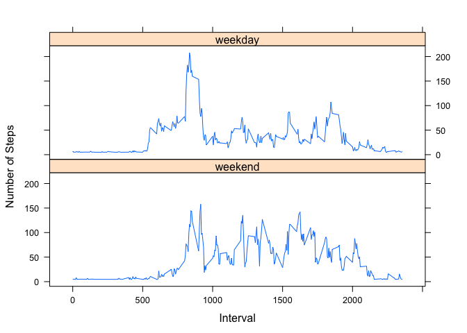

### Directions

Commit containing full submission

1.  Code for reading in the dataset and/or processing the data
2.  Histogram of the total number of steps taken each day
3.  Mean and median number of steps taken each day
4.  Time series plot of the average number of steps taken
5.  The 5-minute interval that, on average, contains the maximum number
    of steps
6.  Code to describe and show a strategy for imputing missing data
7.  Histogram of the total number of steps taken each day after missing
    values are imputed
8.  Panel plot comparing the average number of steps taken per 5-minute
    interval across weekdays and weekends
9.  All of the R code needed to reproduce the results (numbers, plots,
    etc.) in the report

### Part 1: Code for reading in the dataset and/or processing the data

    fileURL <- "https://d396qusza40orc.cloudfront.net/repdata%2Fdata%2Factivity.zip"
    download.file(fileURL, destfile = "Dataset.zip")
    unzip("Dataset.zip")
    stepsdata <- read.csv("activity.csv", header = TRUE, stringsAsFactors = FALSE)
    stepsdata$date <-as.Date(stepsdata$date)

#### Examining the characteristics of the imported data file

    dim(stepsdata)

    ## [1] 17568     3

    summary(stepsdata)

    ##      steps             date               interval     
    ##  Min.   :  0.00   Min.   :2012-10-01   Min.   :   0.0  
    ##  1st Qu.:  0.00   1st Qu.:2012-10-16   1st Qu.: 588.8  
    ##  Median :  0.00   Median :2012-10-31   Median :1177.5  
    ##  Mean   : 37.38   Mean   :2012-10-31   Mean   :1177.5  
    ##  3rd Qu.: 12.00   3rd Qu.:2012-11-15   3rd Qu.:1766.2  
    ##  Max.   :806.00   Max.   :2012-11-30   Max.   :2355.0  
    ##  NA's   :2304

    head(stepsdata)

    ##   steps       date interval
    ## 1    NA 2012-10-01        0
    ## 2    NA 2012-10-01        5
    ## 3    NA 2012-10-01       10
    ## 4    NA 2012-10-01       15
    ## 5    NA 2012-10-01       20
    ## 6    NA 2012-10-01       25

### Part 2: Histogram of the total number of steps taken each day

    library(ggplot2)
    HPlot1 <- ggplot(stepsdata, aes(factor(date), steps), na.rm = TRUE) +
            geom_histogram(binwidth = 2000, fill = "red2", colour = "slategray", size = .1,
            stat = "identity") +
            xlab('Date') +
            ylab('Number of Steps Taken Each Day') +
            theme(axis.text.x = element_text(angle=90, hjust=1, vjust=1)) +
            ggtitle('Histogram of the Total Number of Steps Taken Each Day')
    print(HPlot1)

### Part 3: Mean and median number of steps taken each day

-   The mean number of steps per day is 10766.19 and the median
    is 10765.

<!-- -->

    stepsperday <- aggregate(steps~date, stepsdata, FUN = sum)
    stepsmean <- mean(stepsperday$steps)
    stepsmedian <- median(stepsperday$steps)
    round(stepsmean, digits = 2)

    ## [1] 10766.19

    round(stepsmedian, digits = 2)

    ## [1] 10765

### Part 4: Time series plot of the average number of steps taken

-   Line plot showing the average daily activity pattern.

<!-- -->

    stepsperinterval <- aggregate(steps~interval, stepsdata, FUN = mean)
    plot(stepsperinterval$steps~stepsperinterval$interval, type = "l", xlab = "Interval",
         ylab = "Average steps per 5 minute interval")

### Part 5: The 5-minute interval that, on average, contains the maximum number of steps

-   The 5-minute interval that contains the highest number of steps, on
    average, is interval 835 with 206.1968 steps.

<!-- -->

        maxinterval <-stepsperinterval[stepsperinterval$steps==max(stepsperinterval$steps),]
        print(maxinterval)

    ##     interval    steps
    ## 104      835 206.1698

### Part 6: Code to describe and show a strategy for imputing missing data

-   Using the MICE Package to impute the mean steps by interval.
    Specifying (method = “mean”) and constraining the MICE function to
    one iteration provides the mean being imputed for missing data.  
-   The number of missing values in the data file is 2304.
-   The mean number of steps in the imputed data set is 10766.19 and the
    median is also 10766.19. The effect of imputing the mean to the
    missing data in the data file makes both the mean and the median
    equal to the mean of the data prior to the mean being imputed to the
    missing data. The closeness of the mean prior to the mean imputation
    and the mean and median after the mean imputation implies that the
    missing data is distributed evenly around the mean of the
    distribution.

<!-- -->

    library(mice)
    imp_adata <- mice(stepsdata, method = "mean", m = 1, maxit = 1)

    ## 
    ##  iter imp variable
    ##   1   1  steps

    bdata <- complete(imp_adata, 1)
    steps_imp <- aggregate(steps~date, bdata, FUN = sum)
    stepsimpmean <- mean(steps_imp$steps)
    stepsimpmedian <- median(steps_imp$steps)
    round(stepsimpmean, digits = 2)

    ## [1] 10766.19

    round(stepsimpmedian, digits = 2)

    ## [1] 10766.19

    sum(is.na(stepsdata))

    ## [1] 2304

    nmissing <-dim(stepsdata$steps)-dim(bdata$steps)
    print(nmissing)

    ## integer(0)

### Part 7: Histogram of the total number of steps taken each day after missing values are imputed

    HPlot2 <- ggplot(bdata, aes(factor(date), steps), na.rm = TRUE) +
            geom_histogram(binwidth = 2000, fill = "green3", colour = "slategray", size = .1,
            stat = "identity") +
            xlab('Date') +
            ylab('Number of Steps Taken Each Day') +
            theme(axis.text.x = element_text(angle=90, hjust=1, vjust=1)) +
            ggtitle('Histogram of the Total Number of Steps Taken Each Day with Imputed Mean')
    print(HPlot2)

### Part 8: Panel plot comparing the average number of steps taken per 5 minute interval across weekdays and weekends

#### Create a new factor variable in the data set with two levels, “weekday” and “weekend”

    bdata$date <- as.Date(bdata$date)
    weekdays1 <- c('Monday', 'Tuesday', 'Wednesday', 'Thursday', 'Friday')
    bdata$wDay <- factor((weekdays(bdata$date) %in% weekdays1), 
                 levels=c(FALSE, TRUE), labels=c('weekend', 'weekday'))

#### Make a panel plot containing a time series plot (i.e. type = “l”) of the 5-minute interval (x-axis) and the average number of steps taken, averaged across all weekday days or weekend days

    stepsperWdayWend <- aggregate(steps~interval + wDay, bdata, FUN = mean)
    library(lattice)
    xyplot(steps~interval | factor (wDay),
               data = stepsperWdayWend,
               layout = c(1,2),
               xlab = "Interval",
               ylab = "Number of Steps",
               type = "l")

